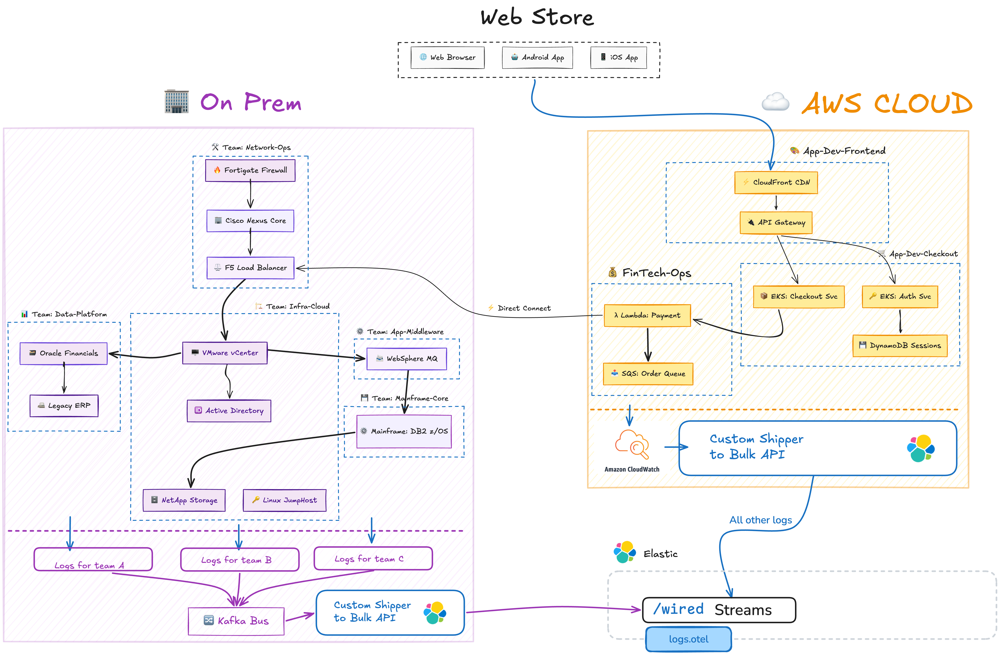

# Streams Messy Logs

## Intro

This repository helps you send **synthetic logs** into Elastic: AWS-style logs (as if collected by CloudWatch) and on-premises-style logs from a variety of services and infrastructure. Use it to demo [Elastic Streams](https://www.elastic.co/docs/solutions/observability/streams/wired-streams), partitioning, processing, and AI-assisted troubleshooting without touching production systems.

> **GCP variant available:** A Google Cloud Platform version of this demo (Cloud Logging, GKE, Cloud Functions, Cloud Armor, etc.) lives in the **[`gcp/`](gcp/README-GCP.md)** folder. See **[gcp/README-GCP.md](gcp/README-GCP.md)** for setup and usage.

The following diagram shows how data flows from the two simulated sources into Elastic wired streams:



- **AWS path**: The `aws_cloudwatch_logs.sh` script simulates logs that would normally be collected by **CloudWatch** from services like API Gateway, Lambda, EKS, WAF, CloudFront, SQS, DynamoDB, and VPC flow logs. These are sent directly to your Elastic cluster as bulk log documents.

- **On-prem path**: The `onprem_kafka_logs.sh` script simulates logs from a **centralised logs team** that aggregates logs from on-prem systems (load balancers, mainframe, Oracle, Active Directory, VMware, WebSphere MQ, Linux jumphosts, etc.) via a **Kafka bus** and then ships them to Elastic. Both scripts share the same bulk behaviour (see below).

- **Both scripts** default to **`POST /logs/_bulk`** when **`--preferred-schema`** is omitted, and print the same **INFO** line (**`logs`** stream **deprecated from Elastic 9.4.0 onwards**; on **9.4.0+** use **`--preferred-schema otel`** or **`ecs`** for **`POST /logs.otel/_bulk`** or **`POST /logs.ecs/_bulk`**). With **`--preferred-schema otel`** or **`ecs`**, data goes to **`logs.otel`** or **`logs.ecs`**, where Elastic **tries to match** incoming documents **to the chosen schema** (OTel vs ECS).

---

## Getting Started

### Prerequisites

- **zsh** (scripts are written for zsh)
- **Elastic Cloud** (or Elastic Stack 9.4+) with **wired streams enabled**
- **API key** with write access to your cluster
- **`--preferred-schema otel`** or **`ecs`** when targeting **Streams 9.4.0+** wired streams; omit the flag for default **`POST /logs/_bulk`** on either script (see intro above)

### Turn on wired streams

Before sending data, enable wired streams in your deployment:

1. In Kibana, go to **Streams** (via the navigation menu or global search), then open **Settings**.
2. Turn on **Enable wired streams**.

See the [official guide](https://www.elastic.co/docs/solutions/observability/streams/wired-streams#streams-wired-streams-enable) for details.

### Configure credentials

Credentials are not stored in the repo. Create a local config from the template:

```bash
cp elastic.env.template elastic.env
```

Edit `elastic.env` and set **ELASTIC_URL** and **API_KEY** (see below). The file `elastic.env` is gitignored and will not be committed.

**Find your Elasticsearch URL**

- **Elastic Cloud**: Open the [Elastic Cloud console](https://cloud.elastic.co), select your deployment, and copy the **Elasticsearch** endpoint from the deployment overview (e.g. `https://your-deployment.es.us-central1.gcp.elastic.cloud`).
- **Kibana**: Go to **Management** → **Stack Management** → **Index Management** (or **Fleet** → **Settings**). The Elasticsearch URL is shown in the cluster/deployment details.

**Generate an API key**

1. In Kibana, go to **Management** → **Stack Management** → **API Keys** (under **Security**).
2. Click **Create API key**. Give it a name (e.g. `streams-messy-logs`).
3. Assign a role that allows writing to indices (e.g. a custom role with `create_index`, `index`, and `create_doc` on `logs.*`, or use a built-in role that includes index management).
4. Create the key and copy the generated **API key** value (base64 string). Store it somewhere safe; the secret is only shown once.

### Run the scripts

**AWS-style (CloudWatch) logs** — default **`POST /logs/_bulk`** (no flag):

```bash
./aws_cloudwatch_logs.sh
```

**On-prem / Kafka-style logs** — same default:

```bash
./onprem_kafka_logs.sh
```

With wired streams (**Streams 9.4.0+**), pass **`otel`** or **`ecs`** on either script:

```bash
./aws_cloudwatch_logs.sh --preferred-schema otel
./onprem_kafka_logs.sh --preferred-schema otel
```

Use **`ecs`** when you want ECS field names preserved without OpenTelemetry-style normalisation:

```bash
./aws_cloudwatch_logs.sh --preferred-schema ecs
./onprem_kafka_logs.sh --preferred-schema ecs
```

---

## Demo

A good way to demo Streams and the AI assistant is to run a short “incident and resolution” cycle.

**Run each script in its own terminal window** so both can send logs at the same time. Use two terminals for the two scripts.

> **FYI — Claude Code:** You can drive the same flow with **[slash commands](#claude-code-skills-slash-commands)** (`/normal-activity`, `/abnormal-activity`, `/kill-demo`) instead of copying shell commands; each step below includes a short tip for the matching skill. Use **`/kill-demo`** anytime to stop ingest without starting again ([details](#claude-code-skills-slash-commands)).

### 1. Baseline (normal)

In **terminal 1**, run the AWS (CloudWatch) script:

```bash
./aws_cloudwatch_logs.sh
```

In **terminal 2**, run the on-prem (Kafka) script:

```bash
./onprem_kafka_logs.sh
```

(Add **`--preferred-schema otel`** or **`ecs`** on either if you use **9.4.0+** wired streams.)

> **Tip — [skills](#claude-code-skills-slash-commands):** Run **`/normal-activity`**. For wired streams, include **otel** or **ECS** in your message (e.g. *`/normal-activity` using otel*) so both scripts get the right **`--preferred-schema`**. The skill stops any old ingest processes first, then starts both in the background (one terminal); use the manual two-terminal commands above if you want separate live dashboards without **`clear`** fighting.

Leave both running for a few minutes so the cluster has a baseline of “healthy” logs.

### 2. Inject failure

Stop both scripts (Ctrl+C in each terminal). Then restart them with `--mode failure` so they send failure-style logs.

In **terminal 1**:

```bash
./aws_cloudwatch_logs.sh --mode failure
```

In **terminal 2**:

```bash
./onprem_kafka_logs.sh --mode failure
```

> **Tip — [skills](#claude-code-skills-slash-commands):** Run **`/abnormal-activity`** (say *using otel* or *with ecs* if you need the same wired-stream path as step 1). It **`pkill`**s existing scripts and starts both in **`--mode failure`**.

Keep both running for a few minutes so there is a clear “during incident” window.

In failure mode:

- **AWS script**: injects 504 Gateway Timeouts and connection failures (e.g. payment/checkout paths), while other paths may still show 200 OK.
- **On-prem script**: switches services to a CRITICAL state (e.g. DB2 lock conflicts, Oracle TNS timeouts, F5 pool down, MQ queue depth warnings).


### 3. Ask the AI Assistant

> **FYI — skills:** No slash command for this step; use Kibana / Agent Builder directly.

Use the [Elastic AI Agent](https://www.elastic.co/docs/explore-analyze/ai-features/agent-builder/builtin-agents-reference#elastic-ai-agent) (or Observability-focused agent) in Agent Builder. For example:

- *“People are complaining they can’t make payments — tell me why.”*
- *“Show me visualisations of when the issue started.”*

### 4. Mitigate (back to normal)

Stop both scripts (Ctrl+C). Simulate recovery by running them again **without** `--mode failure`.

In **terminal 1**:

```bash
./aws_cloudwatch_logs.sh
```

In **terminal 2**:

```bash
./onprem_kafka_logs.sh
```

> **Tip — [skills](#claude-code-skills-slash-commands):** Run **`/normal-activity`** again (use the **same** schema hint as in step 1 if you used **otel** / **ecs**—e.g. *`/normal-activity` using otel*). That replaces “stop then restart” with one command that kills any running ingest and starts both in healthy mode.

### 5. Confirm resolution

> **FYI — skills:** No slash command for this step; return to the AI Assistant in Kibana.

Ask the assistant again:

- *“Is the payment problem resolved?”*
- *“Show me proof with a timeline of before, during, and after the incident.”*

Using Streams (partitioning, processing) and the AI assistant on the same data shows how structured logs and observability tools support detection, explanation, and proof of resolution.

---

## Reference

### Wired streams and the Bulk API

**Both scripts** use **`POST /logs/_bulk`** when **`--preferred-schema`** is omitted (see intro for the shared **INFO** message). When **`otel`** or **`ecs`** is set, data goes to [Elastic wired streams](https://www.elastic.co/docs/solutions/observability/streams/wired-streams) bulk endpoints **`logs.otel`** or **`logs.ecs`**, where Elastic **tries to match** incoming data **to the desired schema** (OTel vs ECS):

- **`otel`** → `POST /logs.otel/_bulk` — OpenTelemetry-style normalisation (e.g. `message` → `body.text`, `log.level` → `severity_text`). See the [field naming table](https://www.elastic.co/docs/solutions/observability/streams/wired-streams#streams-wired-streams-field-naming).
- **`ecs`** → `POST /logs.ecs/_bulk` — ECS field names preserved without that transformation.

The scripts use the [Bulk API](https://www.elastic.co/docs/solutions/observability/streams/wired-streams#streams-wired-streams-ship) with `create` actions, as described in the [Ship data to streams](https://www.elastic.co/docs/solutions/observability/streams/wired-streams#streams-wired-streams-ship) documentation.

After data is in a wired stream, you can:

- **Partition** it into child streams (e.g. by source or team) for clearer organisation and different retention: [Partition data into child streams](https://www.elastic.co/docs/solutions/observability/streams/management/partitioning).
- **Process documents** (extract fields, parse, filter) so logs are structured and useful for users and agents: [Process documents](https://www.elastic.co/docs/solutions/observability/streams/management/extract).

### Command-line flags

| Flag | Description |
|------|-------------|
| `--mode failure` | Switch to a failure scenario (errors, timeouts, critical states). |
| `--logs-per-request N` | Number of log documents per bulk request (default: 100). |
| `--preferred-schema otel \| ecs` | **Optional** for both scripts (omit → `POST /logs/_bulk` + **INFO** about **9.4.0+**). When set, targets **`logs.otel`** or **`logs.ecs`**; Elastic **tries to match** data **to that schema**. |

### Claude Code skills (slash commands)

If you use [Claude Code](https://claude.com/claude-code) with this repo as the **project root**, skills under **`.claude/skills/`** map to slash commands. You need **`elastic.env`** configured (same as running the scripts by hand).

| Command | What it does |
|---------|----------------|
| **`/normal-activity`** | Stops any running ingest scripts, then starts **both** in **healthy** mode. |
| **`/abnormal-activity`** | Same, but both scripts run with **`--mode failure`**. |
| **`/kill-demo`** | Stops both ingest scripts (`pkill`). |

#### Choosing the bulk path (schema)

Skills do **not** take CLI flags. You choose **default `logs` bulk** vs **wired `otel` / `ecs`** by what you say in the **same message** as the slash command; the skill text tells the agent which shell commands to run.

**Default — no preferred schema (`POST /logs/_bulk`)**

- Invoke the command **without** asking for OTel or ECS, for example:
  - **`/normal-activity`**
  - **`/abnormal-activity`**
- The agent runs **`./aws_cloudwatch_logs.sh &`** and **`./onprem_kafka_logs.sh &`** (failure mode adds **`--mode failure`**). Both use **`POST /logs/_bulk`**. Each script prints a yellow **INFO** line about **9.4.0+** and **`--preferred-schema`**.

**OpenTelemetry wired stream (`logs.otel`)**

- Say that you want **OTel**, **OpenTelemetry**, **`logs.otel`**, or **wired streams with OTel**, for example:
  - **`/normal-activity` using otel**
  - **`/abnormal-activity` with OpenTelemetry / logs.otel**
- The agent should start both with **`--preferred-schema otel`**. You get green **INFO** lines with the full **`…/logs.otel/_bulk`** URL.

**ECS wired stream (`logs.ecs`)**

- Say **ECS** or **`logs.ecs`**, for example:
  - **`/normal-activity` with ecs**
  - **`/abnormal-activity` using ECS wired stream**
- The agent should use **`--preferred-schema ecs`** on **both** scripts.

**Stop the demo**

- **`/kill-demo`** (or the **`pkill`** one-liner in **`.claude/skills/kill-demo/SKILL.md`**).

#### Tips

- **Both scripts** should use the **same** **`--preferred-schema`** choice (or both omit it); the skills are written that way.
- If both run in **one** terminal, their **`clear`** loops will **overwrite each other**. Prefer **two terminals** and the manual commands from [Run the scripts](#run-the-scripts), or run them in the **background** and rely on Elastic for verification.
- Skill kill steps use **`pkill … || true`** so “no processes matched” does not fail shells with **`set -e`**.

To change defaults permanently, edit **`SKILL.md`** in **`.claude/skills/normal-activity/`** or **`abnormal-activity/`**.

### Terminal styling

`term_theme.sh` defines ANSI tokens (`T_RED`, `T_CYAN`, `T_BOLD`, …). Both ingest scripts use them **directly in `echo` and `printf`** so headers, HTTP status, API URL, table rows, and errors read clearly—no custom `echo` wrapper or extra packages (unlike optional Python **`rich`** / **`colorama`**). On startup, **`term_logs_deprecation_info`** or **`term_wired_stream_info`** prints a one‑ or two‑line **INFO** to stderr (yellow vs green) when using the default bulk path vs **`otel`** / **`ecs`**.

- Colours apply only when stdout or stderr is a **TTY** (interactive terminal).
- Set **`NO_COLOR=1`** (or any non-empty value) to disable all colour codes, per the [NO_COLOR](https://no-color.org/) convention.

### File layout

| File | Purpose |
|------|---------|
| `aws_cloudwatch_logs.sh` | Sends synthetic AWS/CloudWatch-style logs; default **`POST /logs/_bulk`**, or **`logs.otel` / `logs.ecs`** with **`--preferred-schema`**. |
| `onprem_kafka_logs.sh` | Sends synthetic on-prem/Kafka-style logs; default **`POST /logs/_bulk`**, or **`logs.otel` / `logs.ecs`** with **`--preferred-schema`**. |
| `term_theme.sh` | Shared ANSI helpers: **`term_hr`**, **`term_logs_deprecation_info`** (default **`/logs/_bulk`**), **`term_wired_stream_info`** (**`otel`** / **`ecs`**); sourced by both ingest scripts. |
| `elastic.env.template` | Template for `ELASTIC_URL` and `API_KEY`. Copy to `elastic.env` and fill in. |
| `elastic.env` | Local credentials (gitignored). Create from template; do not commit. |
| `Architecture.png` | Diagram of normal data flow. |
| `Architecture - failure scenario.png` | Diagram of failure scenario. |

### Links

- [Wired streams](https://www.elastic.co/docs/solutions/observability/streams/wired-streams)
- [Wired streams field naming](https://www.elastic.co/docs/solutions/observability/streams/wired-streams#streams-wired-streams-field-naming)
- [Turn on wired streams](https://www.elastic.co/docs/solutions/observability/streams/wired-streams#streams-wired-streams-enable)
- [Ship data to streams (Bulk API)](https://www.elastic.co/docs/solutions/observability/streams/wired-streams#streams-wired-streams-ship)
- [Partition data into child streams](https://www.elastic.co/docs/solutions/observability/streams/management/partitioning)
- [Process documents](https://www.elastic.co/docs/solutions/observability/streams/management/extract)
- [Elastic AI Agent (Agent Builder)](https://www.elastic.co/docs/explore-analyze/ai-features/agent-builder/builtin-agents-reference#elastic-ai-agent)
