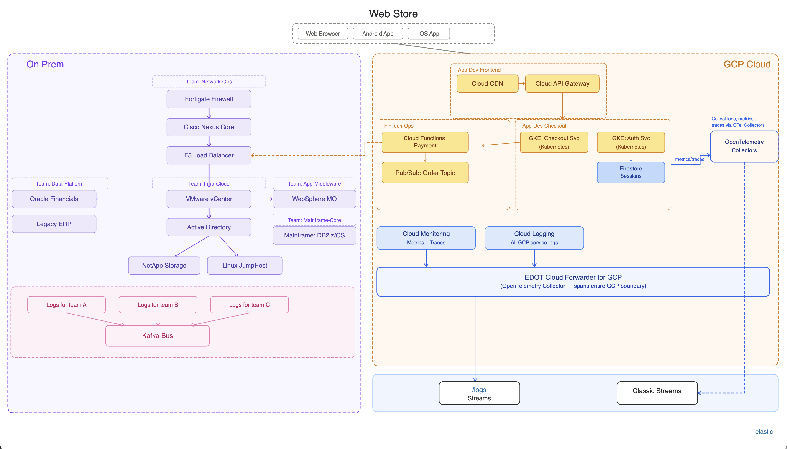

# Streams Messy Logs — GCP Edition

## Intro

This is the **GCP version** of the Streams Messy Logs demo, adapted for presentation at **GCP Next**. It sends synthetic logs that simulate GCP Cloud Logging output and on-prem infrastructure, flowing into Elastic wired streams for demo purposes.

The architecture mirrors the original AWS version but replaces all cloud-side services with their GCP equivalents:

| AWS Service | GCP Equivalent | OTel Support |
|---|---|---|
| CloudWatch | Cloud Logging | ✅ Native OTel export |
| CloudFront CDN | Cloud CDN | ✅ Via Cloud Logging |
| API Gateway | API Gateway (GCP) | ✅ Via Cloud Logging |
| EKS | GKE | ✅ Native OTel collector |
| Lambda | Cloud Functions | ✅ OTel SDK support |
| SQS | Pub/Sub | ✅ Via Cloud Logging |
| DynamoDB | Firestore | ✅ Via Cloud Logging |
| WAF | Cloud Armor | ✅ Via Cloud Logging |
| VPC Flow Logs | VPC Flow Logs | ✅ Via Cloud Logging |
| Smart Connect | Cloud Interconnect | — |

All GCP services listed above can output OpenTelemetry-format logs. GKE and Cloud Functions support the OTel SDK directly; all other services emit structured logs to Cloud Logging, which supports OTel-format export.

### Architecture diagrams

**Normal flow:**



---

## Getting Started

### Prerequisites

- **zsh** (scripts are written for zsh)
- **Elastic Cloud** (or Elastic Stack 9.4+) with **wired streams enabled**
- **API key** with write access to your cluster

### Turn on wired streams

Before sending data, enable wired streams in your deployment:

1. In Kibana, go to **Streams** (via the navigation menu or global search), then open **Settings**.
2. Turn on **Enable wired streams**.

See the [official guide](https://www.elastic.co/docs/solutions/observability/streams/wired-streams#streams-wired-streams-enable) for details.

### Configure credentials

Credentials are not stored in the repo. Create a local config from the template:

```bash
cp elastic.env.template elastic.env
```

Edit `elastic.env` and set **ELASTIC_URL** and **API_KEY**. The file `elastic.env` is gitignored and will not be committed.

### Run the scripts

**GCP application logs (GKE via EDOT collector + Cloud Run payment-gateway):**

```bash
./gke-edot-logs.sh
```

**GCP managed-service system logs (Cloud Run platform events + Cloud SQL PostgreSQL):**

```bash
./gcp-services-logs.sh
```

**On-prem / Kafka-style logs (GCP edition):**

```bash
./onprem_kafka_logs_gcp.sh
```

You can run any combination. Every script sends batches to an Elastic Bulk API every second. `gke-edot-logs.sh` and `onprem_kafka_logs_gcp.sh` target wired streams and default to `logs.otel` (OpenTelemetry-normalised); pass `--preferred-schema ecs` to use ECS field names. `gcp-services-logs.sh` ships native GCP `LogEntry`-shaped documents to `logs.ecs` — Elastic Wired Streams maps them to ECS on ingest.

```bash
./gke-edot-logs.sh --preferred-schema ecs
./onprem_kafka_logs_gcp.sh --preferred-schema ecs
```

---

## Demo

Run a short "incident and resolution" cycle. **Run each script in its own terminal window.**

### 1. Baseline (normal)

In **terminal 1**, run the GCP application log script:

```bash
./gke-edot-logs.sh
```

In **terminal 2**, run the on-prem (Kafka) script:

```bash
./onprem_kafka_logs_gcp.sh
```

Leave both running for a few minutes so the cluster has a baseline of "healthy" logs.

### 2. Inject failure

**IMPORTANT:** both scripts must be restarted in `--mode failure` at the same time. The root cause lives in the on-prem logs and the customer impact lives in the GCP logs — running only one half of the incident will not give the AI Agent enough signal to reconstruct the causal chain.

Stop both scripts (Ctrl+C in each terminal). Then restart them with `--mode failure`.

In **terminal 1**:

```bash
./gke-edot-logs.sh --mode failure
```

In **terminal 2**:

```bash
./onprem_kafka_logs_gcp.sh --mode failure
```

Keep both running for a few minutes so there is a clear "during incident" window.

#### The failure scenario

The e-commerce checkout flow depends on the Cloud Run `payment-gateway` function reaching the on-prem **Oracle Financials** database (`10.50.1.20:1521`) via Cloud Interconnect, fronted by an F5 BIG-IP load balancer pool. Oracle Financials in turn reads user/authorization metadata from the mainframe **DB2 z/OS** catalog via a database link. In failure mode the following happens simultaneously across the two log streams:

**On-prem side (`onprem_kafka_logs_gcp.sh --mode failure`):**

- `onprem-mainframe-db2` — `LOCK CONFLICT: LPAR-PRI-01 Resource DSNDB01.SYSUSER unavailable`. A holding transaction on DB2's user/authorization catalog is blocking every session that touches it.
- `onprem-oracle-financials` — `TNS-12170: Connect timeout occurred from client 10.0.1.5`. Oracle's listener is alive and accepting TCP, but session setup hangs at the authorization step because the Oracle → DB2 database link is waiting on the locked row.
- `onprem-f5-loadbalancer` — `Pool /Common/Oracle_ERP_1521 has no active members`. F5's application-layer health monitor opens a real Oracle session to probe each pool member; those probes hang on the same DB2-blocked code path, time out, and F5 marks every member down.
- `onprem-websphere-mq` — `Queue Depth for 'PAY_SYNC_Q' exceeded threshold (98%)`. The payment-sync consumer cannot commit writes back to Oracle, so MQ messages accumulate unacknowledged.
- `onprem-active-directory` — Kerberos TGT issuance for `svc_gcp_function` continues **normally**. This is deliberate: it lets the Agent rule out identity as the cause.

**GCP side (`gke-edot-logs.sh --mode failure`):**

- Cloud Run `payment-gateway` — `oracle connection timeout via cloud interconnect 10.50.1.20:1521 err="context_deadline_exceeded" duration_ms=29012`. The function authenticates to GCP/AD fine; it just can't get a session on Oracle.
- GKE `checkout` pods — `payment-gateway call FAILED status=503 upstream=cloudrun/payment-gateway latency_ms=28991`.
- GKE `frontend` pods — `GET /cart 502 Bad Gateway upstream=checkout.ecommerce.svc.cluster.local:8080 err="context deadline exceeded"`.
- GKE `product-catalog`, `inventory`, `auth`, `user` pods also emit their own independent errors (pool exhaustion, Spanner timeouts, KMS sign failures, Cloud SQL refusals) — these are **noise** in this scenario. A good RCA should not conflate them with the payment outage.

#### Expected root cause

**DB2 z/OS lock contention on `DSNDB01.SYSUSER` on `LPAR-PRI-01`** is the singular origin. Everything else — Oracle TNS timeouts, F5 pool going empty, MQ queue depth, Cloud Run timeouts, checkout 503s, frontend 502s — is downstream cascade and will self-heal the moment the DB2 lock is released. The repair action is on the mainframe: find the session holding the lock on `DSNDB01.SYSUSER` (via `-DISPLAY DATABASE(DSNDB01) SPACENAM(SYSUSER) LOCKS`), commit/rollback/cancel it, and the whole chain recovers without touching Oracle, F5, Cloud Run, or GKE.

#### What the Agent should rule out

- **Identity / auth** — `onprem-active-directory` is still issuing Kerberos TGTs for `svc_gcp_function` normally, so authentication between GCP and on-prem is healthy.
- **Cloud Run platform health** — no `container_oom`, `readiness_probe_failed`, or `revision_failed` events in `gcp-services-logs.sh` (if running). The serverless runtime is scheduling and serving fine; the failures are in outbound application calls to Oracle.
- **GKE cluster / node health** — no node evictions, image pull failures, or pod restarts in the EDOT metadata. The cluster is fine; individual services are just reporting their own downstream dependency failures.
- **Cloud Interconnect link** — connectivity to `10.50.1.20` exists; it's specifically the Oracle listener on port 1521 that's unresponsive, not the network path.
- **F5 itself** — F5 is correctly reporting "no active members" because its health probes are failing; it is not misconfigured or broken.

### 3. Ask the AI Assistant

Use the [Elastic AI Agent](https://www.elastic.co/docs/explore-analyze/ai-features/agent-builder/builtin-agents-reference#elastic-ai-agent) in Agent Builder. For example:

- *"People are complaining they can't make payments — tell me why."*
- *"Show me visualisations of when the issue started."*

### 4. Mitigate (back to normal)

Stop both scripts (Ctrl+C). Simulate recovery by running them again **without** `--mode failure`.

In **terminal 1**:

```bash
./gke-edot-logs.sh
```

In **terminal 2**:

```bash
./onprem_kafka_logs_gcp.sh
```

### 5. Confirm resolution

Ask the assistant again:

- *"Is the payment problem resolved?"*
- *"Show me proof with a timeline of before, during, and after the incident."*

---

## Differences from the AWS version

| Aspect | AWS version | GCP version |
|---|---|---|
| Cloud log script | `aws_cloudwatch_logs.sh` | `gke-edot-logs.sh` |
| On-prem script | `onprem_kafka_logs.sh` | `onprem_kafka_logs_gcp.sh` |
| Log source field | `aws_cloudwatch` | `gcp_cloud_logging` |
| Log group format | `/aws/service/name` | `projects/ecommerce-prod/logs/service` |
| Service account ref (on-prem AD) | `svc_aws_lambda` | `svc_gcp_function` |
| Cloud interconnect | Smart Connect | Cloud Interconnect |
| Architecture diagrams | `Architecture.png` | `gcp_architecture_diagram.png` |

### On-prem script changes

The original `onprem_kafka_logs.sh` references `svc_aws_lambda` in the Active Directory Kerberos log message (line 96). The GCP edition (`onprem_kafka_logs_gcp.sh`) changes this to `svc_gcp_function` so there are no AWS references when presenting at GCP Next.

---

## Reference

### Command-line flags

| Flag | Description |
|------|-------------|
| `--mode failure` | Switch to a failure scenario (errors, timeouts, critical states). |
| `--logs-per-request N` | Number of log documents per bulk request (default: 100). |
| `--preferred-schema otel \| ecs` | Wired stream schema: `otel` (default) or `ecs`. |

### GCP file layout

| File | Purpose |
|------|---------|
| `gke-edot-logs.sh` | Sends synthetic application logs for all 6 GKE services (frontend, product-catalog, checkout, inventory, auth, user) in EDOT k8sattributes/resourcedetection shape, plus Cloud Run function `payment-gateway` application logs (no K8s attributes). Ships to wired streams (OTel format). |
| `gcp-services-logs.sh` | Thin wrapper around `gcp-services-logs.py`. |
| `gcp-services-logs.py` | Sends native GCP `LogEntry`-shaped system logs for Cloud Run revision `payment-gateway` (cold starts, scaling, OOM, readiness probes) and Cloud SQL PostgreSQL `catalog-db` (checkpoints, autovacuum, slow queries, replication lag). Ships to `logs.ecs`. |
| `onprem_kafka_logs_gcp.sh` | Sends synthetic on-prem/Kafka-style logs (no AWS references) to wired streams. |
| `elastic.env.template` | Template for `ELASTIC_URL` and `API_KEY`. Copy to `elastic.env` and fill in. |
| `elastic.env` | Local credentials (gitignored). Create from template; do not commit. |
| `gcp_architecture_diagram.html` | Interactive architecture diagram (HTML). |
| `gcp_architecture_diagram.png` | Architecture diagram (PNG). |
| `gcp-architecture.svg` | Architecture diagram (SVG). |
| `README-GCP.md` | This file. |

### OTel compatibility notes

All GCP services in this architecture support OpenTelemetry log output:

- **GKE**: Runs the [OTel Collector](https://cloud.google.com/stackdriver/docs/managed-prometheus/setup) as a DaemonSet; native OTel SDK support in application code.
- **Cloud Functions**: Supports the [OpenTelemetry SDK](https://cloud.google.com/functions/docs/monitoring/opentelemetry) for traces and logs.
- **Cloud Logging**: Supports [OTel log export](https://cloud.google.com/logging/docs/export) and is the aggregation point for all other GCP services (API Gateway, Cloud CDN, Cloud Armor, Pub/Sub, Firestore, VPC Flow Logs).
- The scripts default to `logs.otel` which normalises field names to OTel conventions (e.g. `message` → `body.text`, `log.level` → `severity_text`).

### Links

- [Wired streams](https://www.elastic.co/docs/solutions/observability/streams/wired-streams)
- [GCP Cloud Logging](https://cloud.google.com/logging/docs)
- [GCP Cloud Functions OTel](https://cloud.google.com/functions/docs/monitoring/opentelemetry)
- [GKE with OTel Collector](https://cloud.google.com/stackdriver/docs/managed-prometheus/setup)
- [Elastic AI Agent (Agent Builder)](https://www.elastic.co/docs/explore-analyze/ai-features/agent-builder/builtin-agents-reference#elastic-ai-agent)
